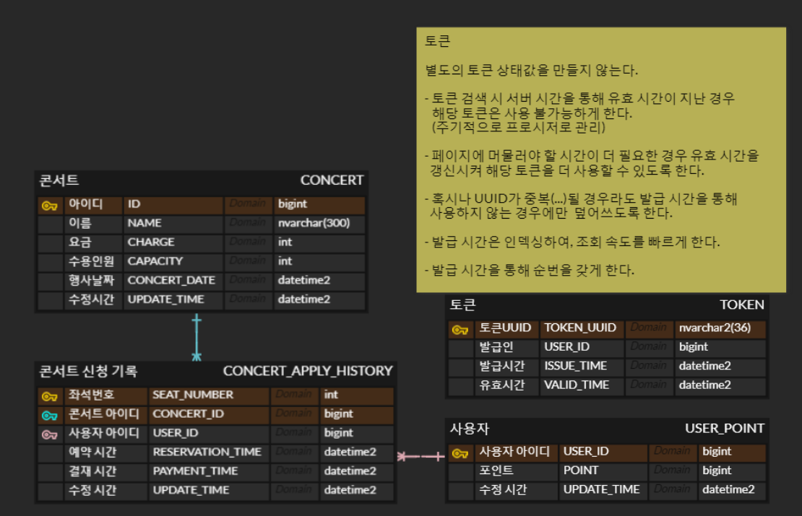

# hhplus_tdd_task_04

코치님 현재시간 금요일 5시 아직 하는 중 입니다. 늦은거 압니다. 하지만 부탁드립니다.
다시는 이렇게 안할 태니 조금만 기다려주세요. 제발요.

## 문서

> 마일스톤과 API 정의서는 위의 노션 공개문서에 있습니다.

[4주차 과제 문서](https://shrub-feels-63d.notion.site/3-da1aa885a46842fe87fecbcae7dc72e5?pvs=4)

## DB 구조

